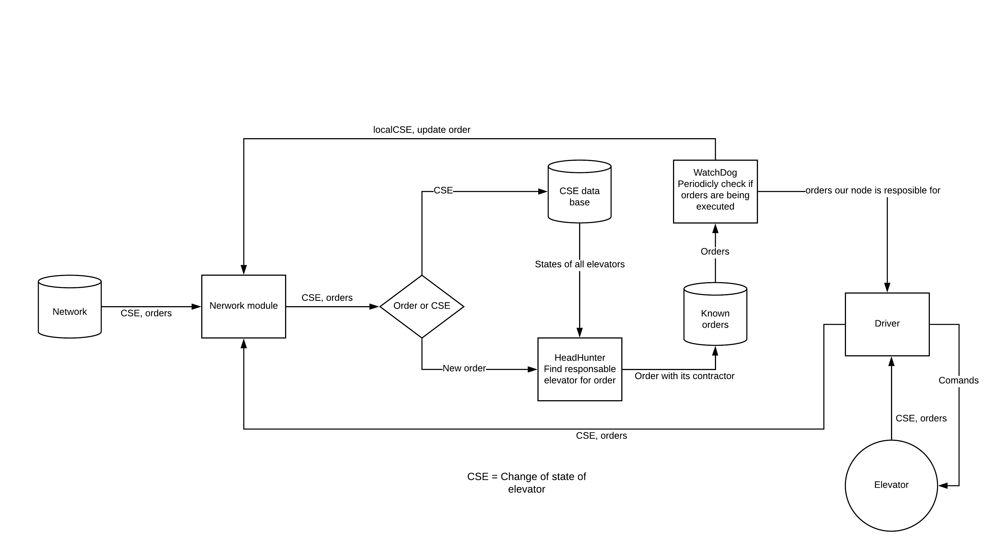

# TTK4145-Elevator
This is Elevator project for course TTK4145 on NTNU.
Focus of project is on desing and implementing code that works even if/when one part of elevators stops working.


# Instruction
To run the project we can simply use ```start.cmd``` which will start 2 elevator nodes. 
Or we can manually run simulator by executing ```./elevator/SimElevatorServer.exe```. Instructions for simulator can be found on [Simulator-v2](https://github.com/TTK4145/Simulator-v2).
And on each simulated elevator we connect "brains" by runnig ```go run main.go A``` where A is port number.

